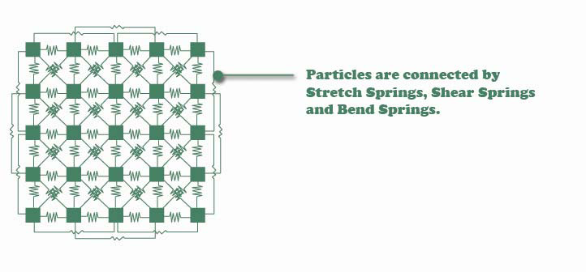

# Cloth Simulation
---
## Introduction
Cloth Simulation with Eular, Runge Kutta2 and Runge Kutta4

This project uses mass-spring model to do the cloth simulation.
In this model, cloth is simulated by a grid of articles which are interconnected with spring-dampers.
Each spring-damper connects two particles and generates a force based on the particles’ positions and velocities. The structure of this model could be illustrated using the image below.

Each particle is also influenced by gravity. With these basic forces, we can form a cloth system.

## Video Link
* [Link](https://youtu.be/p2jU4Dcgj5I
